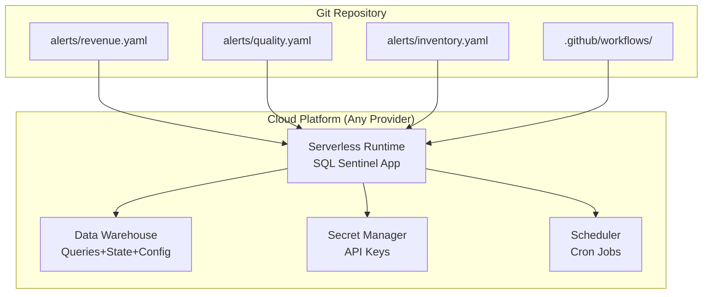

# SQL Sentinel: SQL-First Alerting System for Data Analysts

## Project Overview

SQL Sentinel is an open-source, lightweight alerting system that enables data analysts to monitor business metrics and data quality using only SQL queries. It allows users to define alerts through simple YAML configuration files, execute SQL queries on a schedule, and receive notifications when specified conditions are met.

The system is designed to be cloud-agnostic, deployable via Docker, and requires no programming knowledge beyond SQL. It fills the gap between expensive enterprise monitoring solutions and complex developer-focused tools.

## Problem Statement

Data analysts frequently need to monitor business metrics and alert stakeholders when conditions fall outside expected ranges. Current solutions either:

- Require expensive enterprise licenses (Datadog, New Relic)
- Include unnecessary BI platform overhead (Tableau, Metabase)
- Demand significant technical expertise (Airflow, Prometheus)
- Are abandoned or poorly maintained (various GitHub projects)

Teams need a simple, SQL-first solution that analysts can configure without engineering support.

## Target Users

### Primary Users

- **Data Analysts**: Proficient in SQL but not necessarily in programming
- **Analytics Engineers**: Managing data quality and business metric monitoring
- **Business Intelligence Teams**: Needing automated alerting without full BI platforms
- **Small/Medium Businesses**: Requiring cost-effective monitoring solutions

### Use Cases

- Revenue threshold monitoring (e.g. daily sales below $10,000)
- Data quality checks (e.g. null values exceeding thresholds)
- SLA monitoring (e.g. hourly transaction volumes)
- Inventory alerts (e.g. stock levels below minimum)
- Customer behavior changes (e.g. cart abandonment rates)
- Pipeline monitoring (e.g. ETL job failures or delays)

## Core Functionality

### 1. Configuration System

```yaml
# Example: alerts.yaml
alerts:
  - name: "Low Daily Revenue"
    description: "Alert when yesterday's revenue falls below threshold"
    query: |
      SELECT 
        CASE WHEN SUM(revenue) < 10000 THEN 'ALERT' ELSE 'OK' END as status,
        SUM(revenue) as actual_value,
        10000 as threshold,
        COUNT(*) as order_count
      FROM orders 
      WHERE date = CURRENT_DATE - 1
    schedule: "0 9 * * *" # Daily at 9 AM (cron format)
    notify:
      - channel: email
        recipients: ["team@company.com"]
      - channel: slack
        webhook: "${SLACK_WEBHOOK_URL}"
    metadata:
      severity: "high"
      team: "revenue"
      documentation: "https://wiki/revenue-alerts"
```

### 2. Query Contract

All alert queries must return a result set with:

- **Required**: `status` column with values 'ALERT' or 'OK'
- **Optional**: `actual_value` - the metric value that triggered the alert
- **Optional**: `threshold` - the threshold that was exceeded
- **Optional**: Additional columns for context in notifications

### 3. Supported Databases

Initial support via SQLAlchemy:

- PostgreSQL
- MySQL/MariaDB
- SQLite
- Microsoft SQL Server
- Snowflake
- BigQuery
- Redshift
- DuckDB

Connection via environment variables or connection strings in configuration.

### 4. Notification Channels

- Email (SMTP)
- Slack (webhook)
- Webhook (generic HTTP POST)

### 5. Scheduling Options

- Cron expressions for complex schedules
- Simplified presets: hourly, daily, weekly, monthly
- Timezone support
- Blackout windows (no alerts during maintenance)

## Technical Architecture

### Core Components




#### Data Warehouse-Centric Design:
- **Configuration Storage**: Alert definitions stored in data warehouse tables
- **State Management**: Execution history and alert state in same system as data
- **Data Queries**: Native integration with your existing data warehouse
- **GitOps Workflow**: YAML configs in Git synced to data warehouse via CI/CD


### Deployment Models

1. **Serverless**: AWS Lambda, Google Cloud Run, Azure Functions
2. **Container**: Docker on Kubernetes, ECS, Cloud Run
3. **Development**: Local Docker or Python virtual environment

### State Management (Multi-Cloud)

SQL Sentinel stores minimal state in your existing data warehouse using standard SQL.

**Core Tables (Universal SQL):**
```sql
-- Alert configuration storage
CREATE TABLE sqlsentinel_configs (
  alert_name VARCHAR(255) NOT NULL,
  config JSON,  -- Full YAML config stored as JSON
  is_active BOOLEAN DEFAULT TRUE,
  created_at TIMESTAMP DEFAULT CURRENT_TIMESTAMP(),
  updated_at TIMESTAMP DEFAULT CURRENT_TIMESTAMP()
);

-- Alert execution history  
CREATE TABLE sqlsentinel_executions (
  execution_id VARCHAR(36) NOT NULL,
  alert_name VARCHAR(255) NOT NULL,
  execution_time TIMESTAMP DEFAULT CURRENT_TIMESTAMP(),
  status VARCHAR(50), -- 'ALERT', 'OK', 'ERROR'
  actual_value NUMERIC,
  threshold NUMERIC,
  error_message TEXT,
  notification_sent BOOLEAN DEFAULT FALSE,
  duration_ms INTEGER,
  query_result JSON
);

-- Current alert state (for deduplication)
CREATE TABLE sqlsentinel_state (
  alert_name VARCHAR(255) PRIMARY KEY,
  last_status VARCHAR(50),
  last_alert_time TIMESTAMP,
  consecutive_alerts INTEGER DEFAULT 0,
  is_silenced BOOLEAN DEFAULT FALSE,
  updated_at TIMESTAMP DEFAULT CURRENT_TIMESTAMP()
);
```

**Platform-Specific Optimizations:**
- **BigQuery**: Partitioned tables, `GENERATE_UUID()` functions
- **Snowflake**: Time Travel, `UUID_STRING()` functions  
- **Redshift**: Columnar storage, distribution keys
- **PostgreSQL/MySQL**: Standard indexes and constraints

## Configuration Examples

### Example 1: E-commerce Monitoring

```yaml
alerts:
  - name: "Abandoned Cart Rate High"
    query: |
      WITH cart_stats AS (
        SELECT 
          COUNT(DISTINCT CASE WHEN abandoned THEN session_id END)::FLOAT / 
          COUNT(DISTINCT session_id) as abandonment_rate
        FROM cart_sessions
        WHERE created_at > NOW() - INTERVAL '1 hour'
      )
      SELECT 
        CASE WHEN abandonment_rate > 0.7 THEN 'ALERT' ELSE 'OK' END as status,
        abandonment_rate as actual_value,
        0.7 as threshold
      FROM cart_stats
    schedule: "*/15 * * * *" # Every 15 minutes
    notify:
      - channel: slack
        webhook: "${SLACK_WEBHOOK_URL}"
        template: "🛒 High cart abandonment: {actual_value:.1%} (threshold: {threshold:.1%})"
```

### Example 2: Data Quality Check

```yaml
alerts:
  - name: "Customer Data Completeness"
    query: |
      SELECT 
        CASE WHEN null_percentage > 5 THEN 'ALERT' ELSE 'OK' END as status,
        null_percentage as actual_value,
        5 as threshold,
        total_records,
        null_count
      FROM (
        SELECT 
          COUNT(*) as total_records,
          SUM(CASE WHEN email IS NULL OR phone IS NULL THEN 1 ELSE 0 END) as null_count,
          (SUM(CASE WHEN email IS NULL OR phone IS NULL THEN 1 ELSE 0 END)::FLOAT / COUNT(*)) * 100 as null_percentage
        FROM customers
        WHERE created_date = CURRENT_DATE - 1
      ) AS quality_check
    schedule: "0 6 * * *" # Daily at 6 AM
    notify:
    
      - channel: email
        recipients: ["data-quality@company.com"]
```

## Competitive Advantages

1. **SQL-First**: No proprietary query language or complex DSL
2. **Data Warehouse-Native**: Uses your existing data infrastructure, no additional databases
3. **GitOps Friendly**: Configuration as code, version controlled, synced to data warehouse
4. **Cloud-Agnostic**: Works with BigQuery, Snowflake, Redshift, Synapse, PostgreSQL
5. **Cost Effective**: 70-80% cheaper than traditional solutions (~$10-30/month)
6. **Analyst Focused**: Built for SQL users, integrates with familiar tools
7. **Zero Infrastructure Management**: No separate databases, caches, or storage to maintain
8. **Serverless-Ready**: Scales to zero on all major cloud platforms

## Open Source Strategy

### License

MIT License for maximum adoption

### Community Building

- Clear contribution guidelines
- "Good first issue" labels for newcomers

## Technical Decisions

### Language: Python

- Excellent SQL library ecosystem (SQLAlchemy)
- Strong scheduling libraries (APScheduler, Croniter)
- Familiar to data analysts
- Easy deployment via Docker
- Good cloud function support

### Configuration: YAML

- Human-readable and writable
- Familiar to analysts (dbt, Ansible)
- Supports complex structures
- Easy to version control

### Deployment: Docker-First

- Consistent across environments
- Easy cloud deployment
- No dependency conflicts
- Simple local development

## Risk Mitigation

### Technical Risks

- **Query Performance**: Implement timeouts and resource limits
- **Alert Storms**: Rate limiting and alert grouping
- **Credential Management**: Support for secret managers
- **Database Load**: Query result caching, read replicas

### Business Risks

- **Adoption**: Focus on documentation and ease of use
- **Competition**: Differentiate through simplicity
- **Scope Creep**: Stay focused on SQL alerting

## Getting Started Guide

TODO